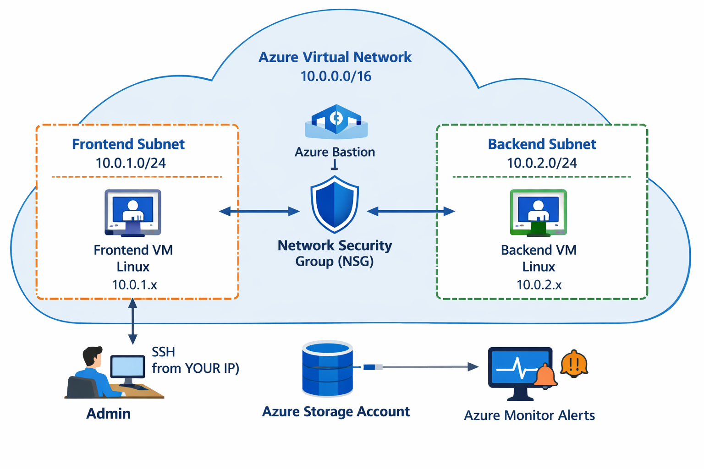

# Azure Infrastructure Deployment Project

## Objective
Design and deploy a secure, scalable, and production-like Azure infrastructure for a startup environment using Azure CLI.

## Scenario
A startup requires:
- Secure virtual network architecture
- Isolation between frontend and backend services
- Controlled and secure access to virtual machines
- Monitoring and alerting capabilities
- Storage solution for data and backups

---

## Architecture

- Virtual Network: 10.0.0.0/16
- Frontend Subnet: 10.0.1.0/24
- Backend Subnet: 10.0.2.0/24
- 2 Linux Virtual Machines (Frontend / Backend)
- Network Security Group (NSG)
- Storage Account
- Azure Monitor Alerts

---

## Step 1: Create Resource Group

Command:
az group create --name rg-cloud-project --location uaenorth

Reason:
The resource group is used to logically organize and manage all Azure resources, enabling easier deployment, monitoring, and cleanup.

---

## Step 2: Create Virtual Network and Subnets

Command:
az network vnet create \
  --resource-group rg-cloud-project \
  --name vnet-main \
  --address-prefix 10.0.0.0/16 \
  --subnet-name frontend-subnet \
  --subnet-prefix 10.0.1.0/24

az network vnet subnet create \
  --resource-group rg-cloud-project \
  --vnet-name vnet-main \
  --name backend-subnet \
  --address-prefix 10.0.2.0/24

Reason:
The virtual network provides isolated communication between resources.
Subnets are used to separate frontend and backend workloads for improved security and scalability.

---

## Step 3: Deploy Virtual Machines

Command:
az vm create \
  --resource-group rg-cloud-project \
  --name vm-frontend \
  --image Ubuntu2204 \
  --vnet-name vnet-main \
  --subnet frontend-subnet \
  --admin-username azureuser \
  --generate-ssh-keys \
  --size Standard_B2s

az vm create \
  --resource-group rg-cloud-project \
  --name vm-backend \
  --image Ubuntu2204 \
  --vnet-name vnet-main \
  --subnet backend-subnet \
  --admin-username azureuser \
  --generate-ssh-keys \
  --size Standard_B2s

Reason:
Separate virtual machines were deployed to simulate a multi-tier architecture.
SSH authentication was used instead of passwords to enhance security.

---

## Step 4: Configure Network Security Group

Command:
az network nsg create \
  --resource-group rg-cloud-project \
  --name nsg-main

az network nsg rule create \
  --resource-group rg-cloud-project \
  --nsg-name nsg-main \
  --name allow-ssh \
  --protocol Tcp \
  --priority 1000 \
  --destination-port-range 22 \
  --access Allow \
  --direction Inbound \
  --source-address-prefix YOUR_IP

Reason:
The NSG restricts inbound traffic and allows SSH access only from a trusted IP address, reducing the attack surface.

---

## Step 5: Create Storage Account

Command:
az storage account create \
  --name mystorageproj123 \
  --resource-group rg-cloud-project \
  --location uaenorth \
  --sku Standard_LRS

Reason:
The storage account is used for storing application data and enabling backup solutions.

---

## Step 6: Configure Monitoring

Command:
az monitor metrics alert create \
  --name cpu-alert \
  --resource-group rg-cloud-project \
  --scopes <vm-resource-id> \
  --condition "avg Percentage CPU > 70" \
  --description "CPU usage alert"

Reason:
Monitoring and alerting enable proactive detection of performance issues and ensure system reliability.

---

## Challenges Faced

1. SSH connection failed due to incorrect NSG configuration  
   - Solution: Updated inbound rule to allow only my IP  

2. Resource deployment errors due to incorrect CLI syntax  
   - Solution: Debugged using Azure CLI documentation  

3. Subnet misconfiguration during initial setup  
   - Solution: Recreated subnet with correct address range  

---

## Skills Demonstrated

- Azure resource provisioning using CLI  
- Virtual network design and subnetting  
- Secure VM deployment with SSH  
- Network security configuration (NSG)  
- Monitoring and alert configuration  
- Troubleshooting and debugging cloud deployments  

---

## Future Improvements

- Automate deployment using Terraform  
- Implement Azure Bastion for secure access  
- Add Load Balancer for high availability  
- Integrate Log Analytics for advanced monitoring  